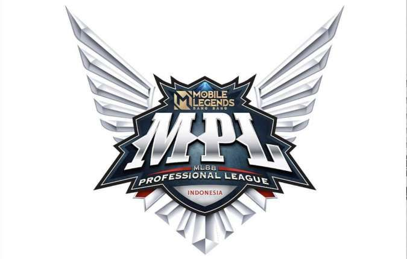
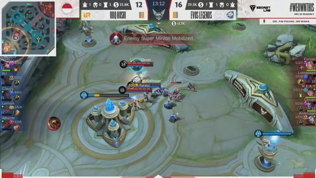

# "MPL ID S9 : EVOS ROAR VS RRQ HOSHI"

Di match ke-19 yang mempertemukan RRQ Hoshi vs Evos Legends berlangsung sengit. Pertarungan el clasico langsung dibuka dengan team fight, dimana kedua tim berusaha mem-pick lawan agar dapat keuntungan di babak pertama ini.

Di match kali ini, Lemon akhirnya bergabung dengan Vyn, Alberttt, R7, dan Clayyy untuk memperkuat kekuatan tim RRQ Hoshi. Dengan heroes Wan-wan, Lemon dapat men-support tim berjulukan "raja dari segala raja" saat war dengan serangan damage yang mampu mengikis health lawan. Hal ini terbukti dari beberapa kali war, Lemon dapat memukul mundur dan beberapa kali membunuh salah satu player dari tim Evos Legends. 
Tak hanya Lemon, Luminaire, Antimage, Clover, Ferxiic, dan Rekt dari Evos Legends juga harus berhadapan dengan pergerakan Alberttt dengan heroes pilihannya, yaitu Fanny. Dengan skill yang dimiliki Fanny, Alberttt mampu mengobrak-abrik permainan dan beberapa kali sukses membunuh player tim berjulukan sang macan putih di MPL ID S9.

## RRQ Hoshi Rebut Kemenangan Babak Pertama

Momen penting terjadi di menit ke-18 ketika kedua tim berebut Lord, RRQ Hoshi berhasil mencuri Lord. Evos Legends pun berusaha memanfaatkan momen untuk pick salah satu player dari RRQ Hoshi. Namun Lemon dkk sudah bersiap terhadap serangan sang macan putih, sehingga dapat men-counter Evos Legends dengan menumbangkan 4 player sekaligus. Hal ini dimanfaatkan RRQ Hoshi untuk mendorong lane, dan masuk ke base yang hanya dijaga oleh Rekt. Namun apa daya, kekuatan RRQ Hoshi masih terlalu kuat di babak pertama.

## Evos Legends Mengganas di Babak 2

Babak kedua diawali dengan Alberttt yang berhasil melakukan first kill, dilanjutkan dengan tumbangnya Luminaire dari Evos Legends.
Mengandalkan skill heroes Mathilda milik Vyn, keempat tim RRQ Hoshi dapat menginisiasi team fight lebih baik.
Namun, Ferxiic yang memilih heroes Aulus mampu meruntuhkan permainan dari tim raja dari segala raja tersebut.

## RRQ Hoshi Tumbang dari Evos Legends

Mengandalkan Ferxiic, Luminaire, dan Rekt, Evos Legends mampu memberikan dan membalas serangan yang dilancarkan oleh tim RRQ Hoshi. Tampil lebih garang dari babak pertama, Evos Legends pun berhasil memenangkan babak kedua. Babak penentuan RRQ Hoshi vs Evo Legends berlangsung panas, dimana Lemon (Miya) dan Alberttt (Fanny) diharapkan mampu mendukung tim RRQ Hoshi saat team fight.
Sementara itu, Evos Legends yang berlajar dari babak kedua ternyata sudah memiliki strategi untuk membatasi pergerakan dua heroes RRQ Hoshi tersebut. Momen penting terjadi saat team fight pada menit ke-12, dimana tim Evos Legends dapat menumbangkan empat player RRQ Hoshi, menembus base dan memangkan babak ketiga ini.