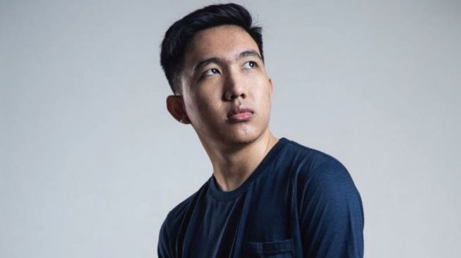

# Alasan Lemon Keluar dari RRQ? Pindah ke EVOS atau ONIC?

Kemarin Lemon sempat posting video di channel YouTube miliknya "RRQ Lemon", dari judul dan thumbnail benar-benar membuat curiga para penggemar tim eSports Rex Regum Qeon. Hingga muncul spekulasi apakah Lemon keluar RRQ? Jika iya, apa alasan Lemon hengkang?

Seperti diketahui Lemon yang memiliki nama asli Muhammad Ikhsan merupakan pemain profesional untuk tim RRQ Hoshi yang berkancah di divisi game Mobile Legends Bang Bang.

Lemon dikenal karakter kalemnya, jarang senyum tapi sekalinya orang melihat dia tersenyum pada langsung heboh sejagat maya. Selain itu, Lemon juga punya skil tinggi yang membawa RRQ Hoshi terus tampil kompetitif.

Prestasi terbarunya membawa RRQ juara turnamen MPL Season 5 Indonesia dan bersiap tampil di ajang Mobile Legends Southeast Asia Cup.

Setiap penampilan RRQ pasti selalu dinantikan aksi dari LJ, Lemon, R7, Xin, dan Vyn. Sebuah line-up yang menggemparkan jagat gaming berkat Meta unik di kompetisi MPL yang juga jadi bahan referensi publik.

Hingga kini, Lemon punya 1,8 juta subscribers di channel pribadinya. Dia punya julukan "Sang Alien", karena keunikannya menguasai Hero yang anti-mainstream. Contohnya Kagura, dengan total lebih dari 3000 Match punya Win Rate tinggi berkisar 90%.

Sangat di luar nalar memang, selain itu Lemon juga menguasai banyak hero yang jarang digunakan orang seperti Minsitthar, Faramis, Vexana sampai mengejutkan penonton MPL Season 5 kemarin.

Tapi tenang, ternyata itu video cuma kilas balik perjalanan karir Lemon di RRQ yang sudah sempat diunggah ke YouTube official RRQ. Bukan pengunduran dirinya, meski suatu waktu bisa saja Ikhsan memilih keluar seperti halnya Donkey dan Oura di EVOS.

Jika kemudian Lemon keluar dari RRQ maka wajar fans mereka kecewa, sebab pemain andalan tim Rex Regum Qeon tersebut sudah berhasil menghibur banyak pihak sampai menjadikannya panutan ketika memilih Hero dan menyusun Meta.

## Lemon Segera Pindah ke EVOS atau ONIC? 

Mungkin sobat sudah tahu kabar beredar kalau si Alien dari Kerajaan Rex Regum Qeon dikabarkan bakal segera menyelesaikan tugasnya. Lemon akan pindah dari RRQ, tapi dia bilang belum akan pensiun sampai minimal tiga tahun lagi.

Kabar ini tersebar luas di Instagram dan komunitas Mobile Legends Indonesia (MLBB ID). Desas-desus kepindahan Lemon ke tim eSports lain bermunculan, Lemon alias Ikhsan sendiri bahkan memposting foto siluet dirinya di IG Stories.

Bagi fans RRQ, tentunya perpindahan Lemon amat mengejutkan sekaligus membuat kecewa. Lemon dianggap sudah jadi Main-roster alias andalan dari RRQ Hoshi di berbagai ajang divisi game Mobile Legends.

Aksi heroik Ikhsan saat bertanding melawan musuh yang kuat selalu jadi tontonan menarik. Dia bahkan sering bikin kejutan dengan menggunakan Hero yang jarang digunakan banyak orang untuk sekelas turnamen Nasional dan kancah dunia.

Tapi itu tidak membuat Lemon mengalah atau kalah begitu saja, dia tetap menang sampai mendapatkan nilai KDA yang memukau. Itulah alasan mengapa RRQ Lemon dijuluki sang Alien karena skilnya di luar nalar dan terlalu jago.

Belum diketahui mengapa Lemon memutuskan keluar dari RRQ dan pindah ke tim mana apakah BTR, ONIC atau bahkan rival abadi mereka yakni EVOS Legends.